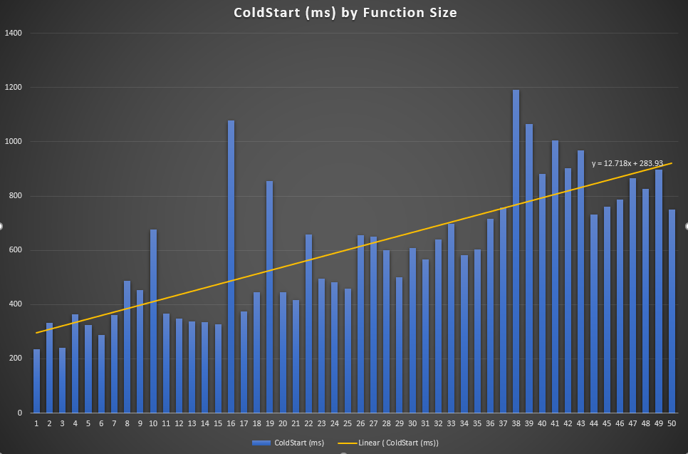

# Serverless Performance Tests - Results BY FUNCTION SIZE

# References

__Columns:__

- Function: the name of the framework(s) used
- Size: the size of the code as reported by AWS Lambda
- VPC: Whether the Lambda function is inside a VPC
- D.Mean: Average (mean) duration of the invocations, as reported by Lambda in CloudWatch Logs.
- Billed Mean: Average (mean) duration of the billed duration. The billed duration is the duration rounded to the closest 100 milliseconds.
- Mem: The memory used as reported by Lambda.
- Var: Variance of the measures of the column on the left.

__Functions:__

All functions are created using Chalice. Besides the default minimal package and extra file of 1MB, 2MB, ..., 49MB was added. This extra file does/should not change the memory usage or compile time of the function. It could affect how often the function gets recycled and the cold start time.

# Results

NOTE: Results are not yet statistically accurate. Not enough samples taken (check back in a few weeks).

### Cold-start statistics

| Function     |   Size(MB) | VPC   |   D.Mean |         Var |   Billed Mean |   Var |   Mem Mean |      Var |   Samples |
|:-------------|-----------:|:------|---------:|------------:|--------------:|------:|-----------:|---------:|----------:|
| psize-0-dev  |       0.01 | No    | 1.312    |  3.39182    |           100 |     0 |    22.6    | 0.3      |         5 |
| psize-1-dev  |       1.01 | No    | 1.658    |  7.05857    |           100 |     0 |    22.6    | 0.3      |         5 |
| psize-2-dev  |       2.01 | No    | 4.604    | 42.1327     |           100 |     0 |    22      | 0        |         5 |
| psize-3-dev  |       3.01 | No    | 6.332    | 66.3196     |           100 |     0 |    22.4    | 0.3      |         5 |
| psize-4-dev  |       4.01 | No    | 0.62     |  0.14515    |           100 |     0 |    22.4    | 0.3      |         5 |
| psize-5-dev  |       5.01 | No    | 5.828    | 61.5228     |           100 |     0 |    22.2    | 0.2      |         5 |
| psize-6-dev  |       6.01 | No    | 2.89     | 28.7479     |           100 |     0 |    22.6    | 0.3      |         5 |
| psize-7-dev  |       7.01 | No    | 1.926    |  4.49763    |           100 |     0 |    22.8    | 0.2      |         5 |
| psize-8-dev  |       8.01 | No    | 1.366    |  4.29673    |           100 |     0 |    23      | 0        |         5 |
| psize-9-dev  |       9.01 | No    | 0.442    |  0.01447    |           100 |     0 |    22.6    | 0.3      |         5 |
| psize-10-dev |      10.01 | No    | 1.108    |  2.25872    |           100 |     0 |    22.4    | 0.3      |         5 |
| psize-11-dev |      11.01 | No    | 3.622    | 52.2329     |           100 |     0 |    22.4    | 0.3      |         5 |
| psize-12-dev |      12.01 | No    | 4.004    | 30.5044     |           100 |     0 |    22.8    | 0.2      |         5 |
| psize-13-dev |      13.01 | No    | 0.42     |  0.01315    |           100 |     0 |    22      | 0        |         5 |
| psize-14-dev |      14.01 | No    | 2.546    | 21.2074     |           100 |     0 |    22.6    | 0.3      |         5 |
| psize-15-dev |      15.01 | No    | 3.354    | 43.6344     |           100 |     0 |    22.4    | 0.3      |         5 |
| psize-16-dev |      16.01 | No    | 1.644    |  7.74103    |           100 |     0 |    22.4    | 0.3      |         5 |
| psize-17-dev |      17.02 | No    | 0.408    |  0.01027    |           100 |     0 |    23      | 0        |         5 |
| psize-18-dev |      18.02 | No    | 0.493333 |  0.0410667  |           100 |     0 |    22.5    | 0.3      |         6 |
| psize-19-dev |      19.02 | No    | 0.508333 |  0.00621667 |           100 |     0 |    22.3333 | 0.266667 |         6 |
| psize-20-dev |      20.02 | No    | 1.766    |  8.24298    |           100 |     0 |    22.6    | 0.3      |         5 |
| psize-21-dev |      21.02 | No    | 4.66833  | 60.8629     |           100 |     0 |    22.1667 | 0.166667 |         6 |
| psize-22-dev |      22.02 | No    | 5.596    | 52.4129     |           100 |     0 |    22.6    | 0.3      |         5 |
| psize-23-dev |      23.02 | No    | 4.74833  | 36.4562     |           100 |     0 |    22.3333 | 0.266667 |         6 |
| psize-24-dev |      24.02 | No    | 2.25     | 16.5181     |           100 |     0 |    22.2    | 0.2      |         5 |
| psize-25-dev |      25.02 | No    | 1.484    |  5.19613    |           100 |     0 |    22.6    | 0.3      |         5 |
| psize-26-dev |      26.02 | No    | 1.586    |  6.60013    |           100 |     0 |    22.4    | 0.3      |         5 |
| psize-27-dev |      27.02 | No    | 3.08     | 27.3002     |           100 |     0 |    22.4    | 0.3      |         5 |
| psize-28-dev |      28.02 | No    | 1.57     |  5.89195    |           100 |     0 |    22.6    | 0.3      |         5 |
| psize-29-dev |      29.02 | No    | 1.502    |  5.30397    |           100 |     0 |    22.2    | 0.2      |         5 |
| psize-30-dev |      30.02 | No    | 0.446    |  0.00328    |           100 |     0 |    22.8    | 0.2      |         5 |
| psize-31-dev |      31.02 | No    | 0.468333 |  0.0111367  |           100 |     0 |    22.3333 | 0.266667 |         6 |
| psize-32-dev |      32.02 | No    | 0.501667 |  0.00969667 |           100 |     0 |    22.5    | 0.3      |         6 |
| psize-33-dev |      33.02 | No    | 2.06333  | 15.2382     |           100 |     0 |    22.6667 | 0.266667 |         6 |
| psize-34-dev |      34.02 | No    | 3.04167  | 41.4932     |           100 |     0 |    22.8333 | 0.166667 |         6 |
| psize-35-dev |      35.02 | No    | 1.69167  |  9.67906    |           100 |     0 |    22.3333 | 0.266667 |         6 |
| psize-36-dev |      36.02 | No    | 1.868    | 10.746      |           100 |     0 |    22.6    | 0.3      |         5 |
| psize-37-dev |      37.02 | No    | 0.418    |  0.00367    |           100 |     0 |    22.4    | 0.3      |         5 |
| psize-38-dev |      38.02 | No    | 0.47     |  0.00646667 |           100 |     0 |    22.5    | 0.333333 |         4 |
| psize-39-dev |      39.02 | No    | 0.512    |  0.05207    |           100 |     0 |    22.4    | 0.3      |         5 |
| psize-40-dev |      40.02 | No    | 0.484    |  0.02053    |           100 |     0 |    22.2    | 0.2      |         5 |
| psize-41-dev |      41.02 | No    | 3.212    | 39.6195     |           100 |     0 |    22.4    | 0.3      |         5 |
| psize-42-dev |      42.02 | No    | 4.24     | 60.3764     |           100 |     0 |    22.6    | 0.3      |         5 |
| psize-43-dev |      43.02 | No    | 0.468    |  0.03212    |           100 |     0 |    22.6    | 0.3      |         5 |
| psize-44-dev |      44.02 | No    | 0.484    |  0.01253    |           100 |     0 |    22.2    | 0.2      |         5 |
| psize-45-dev |      45.02 | No    | 4.052    | 65.4169     |           100 |     0 |    22.2    | 0.2      |         5 |
| psize-46-dev |      46.02 | No    | 2.55     | 22.7944     |           100 |     0 |    22      | 0        |         5 |
| psize-47-dev |      47.02 | No    | 1.252    |  2.16672    |           100 |     0 |    22.6    | 0.3      |         5 |
| psize-48-dev |      48.02 | No    | 0.394    |  0.00463    |           100 |     0 |    22.4    | 0.3      |         5 |
| psize-49-dev |      49.02 | No    | 5.154    | 43.7205     |           100 |     0 |    22.8    | 0.2      |         5 |

### Warm-start statistics

| Function     |   Size(MB) | VPC   |   D.Mean |     Var |   Billed Mean |   Var |   Mem Mean |        Var |   Samples |
|:-------------|-----------:|:------|---------:|--------:|--------------:|------:|-----------:|-----------:|----------:|
| psize-0-dev  |       0.01 | No    |  2.3039  | 15.7214 |           100 |     0 |    22.625  | 0.235266   |       264 |
| psize-1-dev  |       1.01 | No    |  2.37375 | 18.9557 |           100 |     0 |    22.9886 | 0.0112772  |       264 |
| psize-2-dev  |       2.01 | No    |  2.27511 | 19.663  |           100 |     0 |    22.6894 | 0.214944   |       264 |
| psize-3-dev  |       3.01 | No    |  2.58572 | 21.0516 |           100 |     0 |    22.625  | 0.235266   |       264 |
| psize-4-dev  |       4.01 | No    |  2.93667 | 25.5462 |           100 |     0 |    22.5909 | 0.242655   |       264 |
| psize-5-dev  |       5.01 | No    |  2.00432 | 15.362  |           100 |     0 |    22.4053 | 0.241949   |       264 |
| psize-6-dev  |       6.01 | No    |  2.36871 | 16.4144 |           100 |     0 |    22.9583 | 0.0400824  |       264 |
| psize-7-dev  |       7.01 | No    |  2.43277 | 19.8159 |           100 |     0 |    22.7841 | 0.169936   |       264 |
| psize-8-dev  |       8.01 | No    |  2.64682 | 23.073  |           100 |     0 |    23      | 0          |       264 |
| psize-9-dev  |       9.01 | No    |  2.87299 | 27.7339 |           100 |     0 |    22.9659 | 0.0330539  |       264 |
| psize-10-dev |      10.01 | No    |  1.93716 | 15.3718 |           100 |     0 |    22.75   | 0.188213   |       264 |
| psize-11-dev |      11.01 | No    |  2.55659 | 23.501  |           100 |     0 |    22.7765 | 0.174199   |       264 |
| psize-12-dev |      12.01 | No    |  2.51769 | 20.0029 |           100 |     0 |    22.8258 | 0.144429   |       264 |
| psize-13-dev |      13.01 | No    |  2.74856 | 22.3001 |           100 |     0 |    22.8106 | 0.154108   |       264 |
| psize-14-dev |      14.01 | No    |  2.12598 | 15.4345 |           100 |     0 |    22.8977 | 0.0921621  |       264 |
| psize-15-dev |      15.01 | No    |  1.94284 | 17.3375 |           100 |     0 |    22.6591 | 0.225544   |       264 |
| psize-16-dev |      16.01 | No    |  1.87966 | 14.739  |           100 |     0 |    22.9167 | 0.0766793  |       264 |
| psize-17-dev |      17.02 | No    |  2.17742 | 18.0931 |           100 |     0 |    23      | 0          |       264 |
| psize-18-dev |      18.02 | No    |  2.70954 | 23.8282 |           100 |     0 |    22.8973 | 0.0924738  |       263 |
| psize-19-dev |      19.02 | No    |  2.34338 | 18.5286 |           100 |     0 |    22.9354 | 0.0606914  |       263 |
| psize-20-dev |      20.02 | No    |  2.15939 | 17.2432 |           100 |     0 |    22.9735 | 0.0259102  |       264 |
| psize-21-dev |      21.02 | No    |  3.17977 | 27.0381 |           100 |     0 |    22.8213 | 0.147331   |       263 |
| psize-22-dev |      22.02 | No    |  2.79833 | 24.8254 |           100 |     0 |    22.7538 | 0.186297   |       264 |
| psize-23-dev |      23.02 | No    |  2.14624 | 16.3575 |           100 |     0 |    22.9087 | 0.0832438  |       263 |
| psize-24-dev |      24.02 | No    |  2.56261 | 22.1503 |           100 |     0 |    22.9394 | 0.0571494  |       264 |
| psize-25-dev |      25.02 | No    |  2.09087 | 17.3566 |           100 |     0 |    22.7424 | 0.191958   |       264 |
| psize-26-dev |      26.02 | No    |  2.33394 | 17.7222 |           100 |     0 |    22.6932 | 0.213489   |       264 |
| psize-27-dev |      27.02 | No    |  2.66155 | 23.1182 |           100 |     0 |    22.7045 | 0.208953   |       264 |
| psize-28-dev |      28.02 | No    |  2.75572 | 23.0546 |           100 |     0 |    22.9053 | 0.0860554  |       264 |
| psize-29-dev |      29.02 | No    |  2.79447 | 23.3554 |           100 |     0 |    22.6629 | 0.22432    |       264 |
| psize-30-dev |      30.02 | No    |  2.61977 | 20.4374 |           100 |     0 |    22.9962 | 0.00378788 |       264 |
| psize-31-dev |      31.02 | No    |  2.47662 | 20.1176 |           100 |     0 |    22.6502 | 0.228311   |       263 |
| psize-32-dev |      32.02 | No    |  2.22521 | 18.371  |           100 |     0 |    22.7338 | 0.196064   |       263 |
| psize-33-dev |      33.02 | No    |  1.98247 | 15.0084 |           100 |     0 |    22.8669 | 0.11581    |       263 |
| psize-34-dev |      34.02 | No    |  2.88768 | 26.363  |           100 |     0 |    22.9392 | 0.0573535  |       263 |
| psize-35-dev |      35.02 | No    |  2.57916 | 21.4666 |           100 |     0 |    22.7833 | 0.170406   |       263 |
| psize-36-dev |      36.02 | No    |  2.13746 | 17.5001 |           100 |     0 |    22.8333 | 0.139417   |       264 |
| psize-37-dev |      37.02 | No    |  1.8386  | 14.5171 |           100 |     0 |    22.7462 | 0.1901     |       264 |
| psize-38-dev |      38.02 | No    |  2.2824  | 19.245  |           100 |     0 |    23      | 0          |       225 |
| psize-39-dev |      39.02 | No    |  2.70152 | 23.5724 |           100 |     0 |    22.8712 | 0.112628   |       264 |
| psize-40-dev |      40.02 | No    |  2.40045 | 20.4754 |           100 |     0 |    22.5076 | 0.250893   |       264 |
| psize-41-dev |      41.02 | No    |  2.04788 | 16.5562 |           100 |     0 |    22.8788 | 0.106925   |       264 |
| psize-42-dev |      42.02 | No    |  2.18985 | 16.9284 |           100 |     0 |    22.9508 | 0.0469956  |       264 |
| psize-43-dev |      43.02 | No    |  2.40186 | 20.1591 |           100 |     0 |    22.7424 | 0.191958   |       264 |
| psize-44-dev |      44.02 | No    |  1.90106 | 14.9394 |           100 |     0 |    22.6402 | 0.231233   |       264 |
| psize-45-dev |      45.02 | No    |  2.51064 | 22.8394 |           100 |     0 |    22.7917 | 0.165558   |       264 |
| psize-46-dev |      46.02 | No    |  2.55375 | 21.6859 |           100 |     0 |    22.5265 | 0.250245   |       264 |
| psize-47-dev |      47.02 | No    |  2.45712 | 22.2924 |           100 |     0 |    22.9545 | 0.0435534  |       264 |
| psize-48-dev |      48.02 | No    |  2.29303 | 18.643  |           100 |     0 |    22.8864 | 0.101106   |       264 |
| psize-49-dev |      49.02 | No    |  3.02875 | 24.8964 |           100 |     0 |    23      | 0          |       264 |

